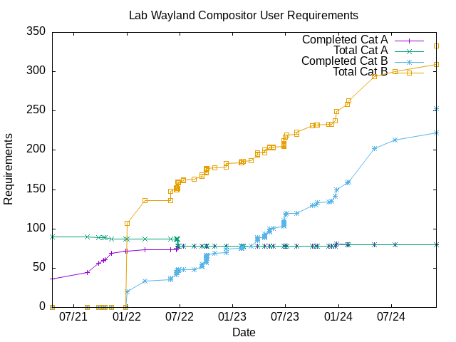

# Scope

<h3 align="center">[<a
href="incomplete-cat-B-items.md">Incomplete&nbsp;Cat&nbsp;B</a>] [<a
href="all-cat-A-and-B-items.md">Cat&nbsp;A&nbsp;and&nbsp;B</a>] [<a
href="stats.md">Stats</a>]</h3>

- [Introduction](#introduction)
- [Requirements](#requirements)
  - General and Protocols
    - [1.1 General](#11-general)
    - [1.2 Wayland Protocols](#12-wayland-protocols)
    - [1.3 wlroots Protocols](#13-wlroots-protocols)
  - Configuration
    - [2.1 Resistance](#21-configuration---resistance)
    - [2.2 Focus](#22-configuration---focus)
    - [2.3 Placement](#23-configuration---placement)
    - [2.4 Theme](#24-configuration---theme)
    - [2.5 Desktop](#25-configuration---desktop)
    - [2.6 Resize](#26-configuration---resize)
    - [2.7 Window Rules](#27-configuration---window-rules)
    - [2.8 Keyboard](#28-configuration---keyboard)
    - [2.9 Mouse](#29-configuration---mouse)
    - [2.10 Margins](#210-configuration---margins)
    - [2.11 Menu](#211-configuration---menu)
    - [2.12 Dock](#212-configuration---dock)
    - [2.13 Core](#213-configuration---core)
    - [2.14 Window Switcher](#214-configuration---window-switcher)
  - Bindings
    - [3.1 Keyboard](#31-configuration---keyboard-keybind)
    - [3.2 Mouse](#32-configuration---mouse-binding)
    - [3.3 Mouse Contexts](#33-configuration---mouse-context)
    - [3.4 Mouse Buttons](#34-configuration---mouse-button)
    - [3.5 Mouse Events](#35-configuration---mouse-event)
  - Actions
    - [4 Global Actions](#4-global-actions)
    - [5 Window Actions](#5-window-actions)
  - Theme
    - [6.1 Geometry](#61-theme---geometry)
    - [6.2 Border Colors](#62-theme---border-colors)
    - [6.3 Titlebar Colors](#63-theme---titlebar-colors)
    - [6.4 Active Window Textures](#64-theme---active-window-textures)
    - [6.5 Inactive Window Textures](#65-theme---inactive-window-textures)
    - [6.6 Active Window Button Textures](#66-theme---active-window-button-textures)
    - [6.7 Inactive Window Button Textures](#67-theme---inactive-window-button-textures)
    - [6.8 Menu Colors](#68-theme---menu-colors)
    - [6.9 Menu Textures](#69-theme---menu-textures)
    - [6.10 On-Screen-Display Textures](#610-theme---on-screen-display-textures)
    - [6.11 On-Screen-Display Colors](#611-theme---on-screen-display-colors)
    - [6.12 Text Justification](#612-theme---text-justification)
    - [6.13 Text Shadows](#613-theme---text-shadows)
  - [7 Menus](#7-menus)
  - [8 Extra](#8-extra)
- [Appendix A - Terminology](#appendix-a---terminology)
- [Appendix B - IPC](#appendix-b---ipc)
- [Appendix C - Configuration Syntax](#appendix-c---configuration-syntax)

# Introduction

In order to reduce commit noise in the main `labwc` repository, scope
is managed here.

A set of user & system requirements were documented early in the project
(initially on the wiki then in this file) to form a baseline against which
developers can:

- define what is in-scope and out-of-scope
- measure progress
- record decisions
- declare the intent of the project
- manage expectations
- produce proporitionate design solutions

This document also help users understand what the project is about and if it is
the sort of compositor they wish to use.

Acceptance criteria for each requirement is in accordance with openbox 3.6
specification unless other wise stated.

## Categorisation

Requirements are categorised as follows:

- `A`: in-scope: "must have" for minimum viable product
- `B+`: in-scope: "should/could have" - likely to implemented at some point
- `B`: discretionary: if devs feel like it and benefits are greater than
       cost (burden) of maintenance and complexity
- `C`: out-of-scope: not intended to be implemented

## Priorities

1. Stabilize current scope and fix issues and bugs. This is quite important.
   We do not want to spend time on an expanding scope with new features until
   the project is reliable at its current scope.
2. Implement `Cat A` requirements.
2. Implement `Cat B+` requirements.
2. Review `Cat B` requirements and try to demote as many as possible to C

## Current status


## Sections

- Requirements are organised into the sections listed below.
- The first digit in the reference number relates to the section.
- Sections 2-7 refer to the the openbox 3.6 specification. For further details
  read the respective openbox wiki page.

1. General and Protocols
2. Configuration [http://openbox.org/wiki/Help:Configuration](http://openbox.org/wiki/Help:Configuration)
3. Bindings [http://openbox.org/wiki/Help:Bindings](http://openbox.org/wiki/Help:Bindings)
4. Global Actions [http://openbox.org/wiki/Help:Actions](http://openbox.org/wiki/Help:Actions)
5. Window Actions [http://openbox.org/wiki/Help:Actions](http://openbox.org/wiki/Help:Actions)
6. Theme [http://openbox.org/wiki/Help:Themes](http://openbox.org/wiki/Help:Themes)
7. Menus [http://openbox.org/wiki/Help:Menus](http://openbox.org/wiki/Help:Menus)
8. Extra

# Requirements

## 1.1 General

| Cat | Status   | Reference | Category                        | Description                                             | Comment
| --- | -------- | --------- | ------------------------------- | ------------------------------------------------------- | -------
|  A  | complete | 1.1.1     | general                         | Optionally support Xwayland                             |
|  A  | complete | 1.1.2     | general                         | Parse `<config-dir>/rc.xml`                             |
|  A  | complete | 1.1.3     | general                         | Parse `<config-dir>/environment`                        |
|  A  | complete | 1.1.4     | general                         | Parse `<config-dir>/autostart`                          |
|  A  | complete | 1.1.5     | general                         | Parse `<config-dir>/menu.xml`                           |
|  A  | complete | 1.1.6     | general                         | Parse openbox themes files and associated xbm icons     |
|  A  | complete | 1.1.7     | general                         | Catch SIGHUP to re-load config file and theme           |
|  A  | complete | 1.1.8     | general                         | Support both CSD and SSD                                |
|  A  | complete | 1.1.9     | general                         | Support maximize, iconify, close buttons                |
|  A  | complete | 1.1.10    | general                         | Support damage tracking to reduce CPU usage             |
|  A  | complete | 1.1.11    | general                         | Support HiDPI                                           |
|  A  | complete | 1.1.12    | general                         | Support on-screen display (osd)                         |
|  A  | complete | 1.1.13    | general                         | Support libinput configuration                          |
|  A  | complete | 1.1.14    | general                         | Support drag-n-drop                                     |

## 1.2 Wayland Protocols

| Cat | Status   | Reference | Category                        | Description                                             | Comment
| --- | -------- | --------- | ------------------------------- | ------------------------------------------------------- | -------
|  B  | complete | 1.2.1     | wayland-protocol                | [presentation-time]                                     |
|  B  | complete | 1.2.2     | wayland-protocol                | [viewporter]                                            |
|  A  | complete | 1.2.3     | wayland-protocol                | [xdg-shell]                                             |
|  B  | complete | 1.2.4     | wayland-protocol                | fullscreen-shell-unstable-v1                            |
|  B  | complete | 1.2.5     | wayland-protocol                | idle-inhibit-unstable-v1                                |
|  B  |          | 1.2.6     | wayland-protocol                | input-method-unstable-v1                                |
|  B  |          | 1.2.7     | wayland-protocol                | input-timestamps-unstable-v1                            |
|  B  |          | 1.2.8     | wayland-protocol                | keyboard-shortcuts-inhibit-unstable-v1                  | This is controversial [^3]
|  B  |          | 1.2.9     | wayland-protocol                | linux-dmabuf-unstable-v1                                |
|  B  |          | 1.2.10    | wayland-protocol                | linux-explicit-synchronization-unstable-v1              |
|  B  | complete | 1.2.11    | wayland-protocol                | pointer-constraints-unstable-v1                         |
|  B  |          | 1.2.12    | wayland-protocol                | pointer-gestures-unstable-v1                            |
|  B  | complete | 1.2.13    | wayland-protocol                | primary-selection-unstable-v1                           |
|  B  | complete | 1.2.14    | wayland-protocol                | relative-pointer-unstable-v1                            |
|  B  |          | 1.2.15    | wayland-protocol                | tablet-unstable-v2                                      |
|  B  |          | 1.2.16    | wayland-protocol                | text-input-unstable-v3                                  |
|  B  | complete | 1.2.17    | wayland-protocol                | xdg-decoration-unstable-v1                              |
|  B  |          | 1.2.18    | wayland-protocol                | xdg-foreign-unstable-v2                                 |
|  B  | complete | 1.2.19    | wayland-protocol                | xdg-output-unstable-v1                                  |
|  B  |          | 1.2.20    | wayland-protocol                | xwayland-keyboard-grab-unstable-v1                      |
|  B  | complete | 1.2.21    | wayland-protocol                | drm-lease-v1                                            |
|  B  | complete | 1.2.22    | wayland-protocol                | [ext-session-lock-v1]                                   | This is more secure [^1]
|  B  | complete | 1.2.23    | wayland-protocol                | xdg-activation-v1                                       |
|  B  | complete | 1.2.24    | wayland-protocol                | single-pixel-buffer-v1                                  |

[presentation-time]: https://gitlab.freedesktop.org/wayland/wayland-protocols/-/tree/main/stable/presentation-time
[viewporter]: https://gitlab.freedesktop.org/wayland/wayland-protocols/-/tree/main/stable/viewporter
[xdg-shell]: https://gitlab.freedesktop.org/wayland/wayland-protocols/-/tree/main/stable/xdg-shell
[ext-session-lock-v1]: https://gitlab.freedesktop.org/wayland/wayland-protocols/-/tree/main/staging/ext-session-lock

## 1.3 wlroots Protocols

| Cat | Status   | Reference | Category                        | Description                                             | Comment
| --- | -------- | --------- | ------------------------------- | ------------------------------------------------------- | -------
|  B  | complete | 1.3.1     | wlr-protocol                    | wlr-data-control-unstable-v1                            |
|  B  | complete | 1.3.2     | wlr-protocol                    | wlr-export-dmabuf-unstable-v1                           |
|  A  | complete | 1.3.3     | wlr-protocol                    | wlr-foreign-toplevel-management-unstable-v1             |
|  B  | complete | 1.3.4     | wlr-protocol                    | wlr-gamma-control-unstable-v1                           |
|  B  | complete | 1.3.5     | wlr-protocol                    | wlr-input-inhibitor-unstable-v1                         |
|  A  | complete | 1.3.6     | wlr-protocol                    | wlr-layer-shell-unstable-v1                             |
|  A  | complete | 1.3.7     | wlr-protocol                    | wlr-output-management-unstable-v1                       |
|  B  | complete | 1.3.8     | wlr-protocol                    | wlr-output-power-management-unstable-v1                 |
|  B  | complete | 1.3.9     | wlr-protocol                    | wlr-screencopy-unstable-v1                              |
|  B  | complete | 1.3.10    | wlr-protocol                    | wlr-virtual-pointer-unstable-v1                         |
|  B  | complete | 1.3.11    | wlr-protocol                    | [kde-server-decoration]                                 | xdg-decoration is preferable, but we support this until GTK move across

[kde-server-decoration]: https://wayland.app/protocols/kde-server-decoration

## 2.1 Configuration - Resistance

| Cat | Status   | Reference | Category                        | Description                                             | Comment
| --- | -------- | --------- | ------------------------------- | ------------------------------------------------------- | -------
|  B  |          | 2.1.1     | resistance                      | `strength`                                              | If we implement, consider a better name
|  A  | complete | 2.1.2     | resistance                      | `screen_edge_strength`                                  |

## 2.2 Configuration - Focus

| Cat | Status   | Reference | Category                        | Description                                             | Comment
| --- | -------- | --------- | ------------------------------- | ------------------------------------------------------- | -------
|  C  |          | 2.2.1     | focus                           | `focusNew`                                              |
|  C  |          | 2.2.2     | focus                           | `focusLast`                                             |
|  B  | complete | 2.2.3     | focus                           | `followMouse`                                           |
|  C  |          | 2.2.4     | focus                           | `focusDelay`                                            |
|  B  | complete | 2.2.5     | focus                           | `followMouseRequiresMovement`                           | DEVIATION It is called `underMouse` in Openbox
|  B  | complete | 2.2.6     | focus                           | `raiseOnFocus`                                          |

## 2.3 Configuration - Placement

| Cat | Status   | Reference | Category                        | Description                                             | Comment
| --- | -------- | --------- | ------------------------------- | ------------------------------------------------------- | -------
|  C  |          | 2.3.1     | placement                       | `policy`                                                |
|  A  | complete | 2.3.2     | placement                       | `center`                                                | No config - just do it

## 2.4 Configuration - Theme

| Cat | Status   | Reference | Category                        | Description                                             | Comment
| --- | -------- | --------- | ------------------------------- | ------------------------------------------------------- | -------
|  A  | complete | 2.4.1     | theme                           | `name`                                                  |
|  B+ |          | 2.4.2     | theme                           | `titleLayout`                                           |
|  B  |          | 2.4.4     | theme                           | `keepBorder`                                            |
|  C  |          | 2.4.5     | theme                           | `animateIconify`                                        |
|  A  | complete | 2.4.6     | theme                           | `<font place="ActiveWindow">`                           |
|  B  |          | 2.4.7     | theme                           | `<font place="InactiveWindow">`                         |
|  B  |          | 2.4.8     | theme                           | `<font place="MenuHeader">`                             |
|  B  | complete | 2.4.9     | theme                           | `<font place="MenuItem">`                               |
|  B  | complete | 2.4.10    | theme                           | `<font place="OnScreenDisplay">`                        |
|  B  | complete | 2.4.11    | theme                           | `<font place=""><name>`                                 |
|  B  | complete | 2.4.12    | theme                           | `<font place=""><size>`                                 |
|  B  | complete | 2.4.13    | theme                           | `<font place=""><weight>`                               |
|  B  | complete | 2.4.14    | theme                           | `<font place=""><slant>`                                |

## 2.5 Configuration - Desktop

The solution shall provide simple workspace setup as follows:

- [x] a. A workspace covers all outputs
- [x] b. The A-Tab OSD only shows windows from the active workspace
- [x] c. A window can only be in a single workspace at any given point in time
         (no tags)
- [x] d. External panels will show all windows.
- [x] e. When activating a window which is on a different workspace the
         compositor shall switch to that workspace automatically
- [x] f. Configure workspaces as shown in example below.

```
<desktops number="">
  <popupTime>1000</popupTime>
  <names>
    <name>foo</name>
    <name>bar</name>
  </names>
<desktops>
```

UNDECIDED: Workspace control by clients, for example panels.
It depends on what happens with:
- https://gitlab.freedesktop.org/wayland/wayland-protocols/-/merge_requests/40
- https://gitlab.freedesktop.org/wayland/wayland-protocols/-/merge_requests/59
- https://gitlab.freedesktop.org/wayland/wayland-protocols/-/merge_requests/60

| Cat | Status   | Reference | Category                        | Description                                             | Comment
| --- | -------- | --------- | ------------------------------- | ------------------------------------------------------- | -------
|  B  | complete | 2.5.1     | desktop                         | `number`                                                |
|  C  |          | 2.5.2     | desktop                         | `firstDesk`                                             | Use first `<name>`
|  B  | complete | 2.5.3     | desktop                         | `popupTime`                                             |
|  B  | complete | 2.5.4     | desktop                         | `names`                                                 |

## 2.6 Configuration - Resize

| Cat | Status   | Reference | Category                        | Description                                             | Comment
| --- | -------- | --------- | ------------------------------- | ------------------------------------------------------- | -------
|  C  |          | 2.6.1     | resize                          |                                                         |

## 2.7 Configuration - Window Rules

Note: In Openbox this section is called `<applications>` (per window settings)
and covers the following settings: `decor` `shade` `position` `size` `focus`
`desktop` `layer` `iconic` `skip_pager` `skip_taskbar` `fullscreen` `maximized`

```
<windowRules>
  <windowRule identifier="alacritty"><action name="Maximize"/></windowRule>
  <windowRule identifier="foo*" serverDecoration="yes|no"/>
</windowRules>
```

| Cat | Status   | Reference | Category                        | Description                                             | Comment
| --- | -------- | --------- | ------------------------------- | ------------------------------------------------------- | -------
|  B  | complete | 2.7.1     | window rules                    | `windowRule`                                            | EXTRA
|  B  | complete | 2.7.2     | window rules                    | `windowRule.identifier`                                 | EXTRA
|  B  | complete | 2.7.3     | window rules                    | `windowRule.title`                                      | EXTRA
|  B  | complete | 2.7.4     | window rules                    | `windowRule.serverDecoration`                           | EXTRA
|  B  |          | 2.7.5     | window rules                    | `windowRule.allowFocusRequest`                          | EXTRA

## 2.8 Configuration - Keyboard

| Cat | Status   | Reference | Category                        | Description                                             | Comment
| --- | -------- | --------- | ------------------------------- | ------------------------------------------------------- | -------
|  C  |          | 2.8.1     | keyboard                        | `rebindOnMappingNotify`                                 |
|  C  |          | 2.8.2     | keyboard                        | `chainQuitKey`                                          |
|  A  | complete | 2.8.3     | keyboard                        | `keybind`                                               |

## 2.9 Configuration - Mouse

| Cat | Status   | Reference | Category                        | Description                                             | Comment
| --- | -------- | --------- | ------------------------------- | ------------------------------------------------------- | -------
|  C  |          | 2.9.1     | mouse                           | `dragThreshold`                                         |
|  A  | complete | 2.9.2     | mouse                           | `doubleClickTime`                                       |
|  C  |          | 2.9.3     | mouse                           | `screenEdgeWarpTime`                                    |
|  A  | complete | 2.9.3     | mouse                           | `context`                                               |

## 2.10 Configuration - Margins

`<margin top="" bottom="" left="" right="" output="" />`

| Cat | Status   | Reference | Category                        | Description                                             | Comment
| --- | -------- | --------- | ------------------------------- | ------------------------------------------------------- | -------
|  B  | complete | 2.10.1    | margins                         | `<margin>`                                              |

## 2.11 Configuration - Menu

| Cat | Status   | Reference | Category                        | Description                                             | Comment
| --- | -------- | --------- | ------------------------------- | ------------------------------------------------------- | -------
|  B  |          | 2.11.1    | menu                            | `hideDelay`                                             |
|  C  |          | 2.11.2    | menu                            | `middle`                                                |
|  B  |          | 2.11.3    | menu                            | `submenuShowDelay`                                      |
|  C  |          | 2.11.4    | menu                            | `applicationIcons`                                      |
|  C  |          | 2.11.5    | menu                            | `manageDesktops`                                        |
|  B  |          | 2.11.6    | menu                            | `file`                                                  | TODO: is this supported already?

## 2.12 Configuration - Dock

| Cat | Status   | Reference | Category                        | Description                                             | Comment
| --- | -------- | --------- | ------------------------------- | ------------------------------------------------------- | -------
|  C  |          | 2.12.1    | dock                            |                                                         |

## 2.13 Configuration - Core

The `<core>` section is additional to openbox 3.6 spec.

| Cat | Status   | Reference | Category                        | Description                                             | Comment
| --- | -------- | --------- | ------------------------------- | ------------------------------------------------------- | -------
|  B  | complete | 2.13.1    | core                            | `decoration`                                            | EXTRA
|  B  | complete | 2.13.1    | core                            | `gap`                                                   | EXTRA
|  B  | complete | 2.13.1    | core                            | `adaptiveSync`                                          | EXTRA
|  B  | complete | 2.13.1    | core                            | `reuseOutputMode`                                       | EXTRA

## 2.14 Configuration - Window Switcher

| Cat | Status   | Reference | Category                        | Description                                             | Comment
| --- | -------- | --------- | ------------------------------- | ------------------------------------------------------- | -------
|  B  | complete | 2.13.1    | window switcher                 | `show`                                                  | EXTRA
|  B  | complete | 2.13.2    | window switcher                 | `preview`                                               | EXTRA
|  B  | complete | 2.13.3    | window switcher                 | `outlines`                                              | EXTRA
|  B  | complete | 2.13.4    | window switcher                 | `fields.field`                                          | EXTRA
|  B  | complete | 2.13.5    | window switcher                 | `fields.field.content`                                  | EXTRA
|  B  | complete | 2.13.6    | window switcher                 | `fields.field.width`                                    | EXTRA

## 3.1 Configuration - Keyboard Keybind

| Cat | Status   | Reference | Category                        | Description                                             | Comment
| --- | -------- | --------- | ------------------------------- | ------------------------------------------------------- | -------
|  A  | complete | 3.1.1     | keyboard keybind                | `key`                                                   |
|  A  | complete | 3.1.2     | keyboard keybind                | `action.name`                                           |
|  A  | complete | 3.1.3     | keyboard keybind                | `action.menu`                                           |
|  A  | complete | 3.1.4     | keyboard keybind                | Support modifier keys                                   |
|  C  |          | 3.1.5     | keyboard keybind                | Support key chains                                      |
|  B  | complete | 3.1.6     | keyboard binding                | `default`                                               | EXTRA

## 3.2 Configuration - Mouse Binding

| Cat | Status   | Reference | Category                        | Description                                             | Comment
| --- | -------- | --------- | ------------------------------- | ------------------------------------------------------- | -------
|  A  | complete | 3.2.1     | mouse binding                   | `context.name`                                          |
|  A  | complete | 3.2.2     | mouse binding                   | `mousebind.button`                                      |
|  A  | complete | 3.2.3     | mouse binding                   | `mousebind.action`                                      |
|  B  | complete | 3.2.4     | mouse binding                   | `default`                                               | EXTRA

## 3.3 Configuration - Mouse Context

| Cat | Status   | Reference | Category                        | Description                                             | Comment
| --- | -------- | --------- | ------------------------------- | ------------------------------------------------------- | -------
|  B  | complete | 3.3.1     | mouse context                   | `Frame`                                                 |
|  B  | complete | 3.3.2     | mouse context                   | `Client`                                                |
|  B  | complete | 3.3.3     | mouse context                   | `Desktop`                                               |
|  B  | complete | 3.3.4     | mouse context                   | `Root`                                                  | DEVIATION [^2]
|  A  | complete | 3.3.5     | mouse context                   | `Titlebar`                                              |
|  B  | complete | 3.3.6     | mouse context                   | `Top`                                                   |
|  B  | complete | 3.3.7     | mouse context                   | `Bottom`                                                |
|  B  | complete | 3.3.8     | mouse context                   | `Left`                                                  |
|  B  | complete | 3.3.9     | mouse context                   | `Right`                                                 |
|  B  | complete | 3.3.10    | mouse context                   | `TLCorner`                                              |
|  B  | complete | 3.3.11    | mouse context                   | `TRCorner`                                              |
|  B  | complete | 3.3.12    | mouse context                   | `BLCorner`                                              |
|  B  | complete | 3.3.13    | mouse context                   | `BRCorner`                                              |
|  B  |          | 3.3.14    | mouse context                   | `Icon`                                                  |
|  A  | complete | 3.3.15    | mouse context                   | `Iconfiy`                                               |
|  A  | complete | 3.3.16    | mouse context                   | `Maximize`                                              |
|  A  | complete | 3.3.17    | mouse context                   | `Close`                                                 |
|  C  |          | 3.3.18    | mouse context                   | `AllDesktops`                                           |
|  C  |          | 3.3.19    | mouse context                   | `Shade`                                                 |
|  C  |          | 3.3.20    | mouse context                   | `Moveresize`                                            |
|  B  | complete | 3.3.21    | mouse context                   | `Title`                                                 | EXTRA

## 3.4 Configuration - Mouse Button

| Cat | Status   | Reference | Category                        | Description                                             | Comment
| --- | -------- | --------- | ------------------------------- | ------------------------------------------------------- | -------
|  A  | complete | 3.4.1     | mouse button                    | `Left`                                                  |
|  A  | complete | 3.4.1     | mouse button                    | `Right`                                                 |
|  B  |          | 3.4.1     | mouse button                    | `Middle`                                                |
|  B  | complete | 3.4.1     | mouse button                    | `Up` (scroll)                                           |
|  B  | complete | 3.4.1     | mouse button                    | `Down` (scroll)                                         |

## 3.5 Configuration - Mouse Event

| Cat | Status   | Reference | Category                        | Description                                             | Comment
| --- | -------- | --------- | ------------------------------- | ------------------------------------------------------- | -------
|  A  | complete | 3.5.1     | mouse event                     | `Press`                                                 |
|  A  | complete | 3.5.2     | mouse event                     | `Click`                                                 |
|  A  | complete | 3.5.3     | mouse event                     | `DoubleClick`                                           |
|  B  |          | 3.5.4     | mouse event                     | `Release`                                               |
|  B  | complete | 3.5.5     | mouse event                     | `Drag`                                                  |
|  B  | complete | 3.5.6     | mouse event                     | `Scroll`                                                | DEVIATION: Scroll is used instead of Click for mouse-buttons Up/Down

## 4 Global Actions

| Cat | Status   | Reference | Category                        | Description                                             | Comment
| --- | -------- | --------- | ------------------------------- | ------------------------------------------------------- | -------
|  A  | complete | 4.1       | global action                   | `Execute`                                               |
|  A  | complete | 4.2       | global action                   | `ShowMenu`                                              |
|  A  | complete | 4.3       | global action                   | `NextWindow`                                            |
|  C  |          | 4.4       | global action                   | `PreviousWindow`                                        |
|  B  |          | 4.5       | global action                   | `DirectionalCycleWindows`                               |
|  B  |          | 4.6       | global action                   | `DirectionalTargetWindows`                              |
|  B  | complete | 4.7       | global action                   | `GoToDesktop`                                           |
|  B  | complete | 4.7.1     | global action                   | `GoToDesktop.to`                                        |
|  B  | complete | 4.7.1.1   | global action                   | `GoToDesktop.to::last`                                  |
|  B  | complete | 4.7.1.2   | global action                   | `GoToDesktop.to::right`                                 |
|  B  | complete | 4.7.1.3   | global action                   | `GoToDesktop.to::left`                                  |
|  C  |          | 4.7.1.4   | global action                   | `GoToDesktop.to::current`                               |
|  C  |          | 4.7.1.5   | global action                   | `GoToDesktop.to::next`                                  |
|  C  |          | 4.7.1.6   | global action                   | `GoToDesktop.to::previous`                              |
|  C  |          | 4.7.1.7   | global action                   | `GoToDesktop.to::up`                                    |
|  C  |          | 4.7.1.8   | global action                   | `GoToDesktop.to::down`                                  |
|  C  |          | 4.7.1.9   | global action                   | `GoToDesktop.to::north`                                 |
|  C  |          | 4.7.1.10  | global action                   | `GoToDesktop.to::south`                                 |
|  C  |          | 4.7.1.11  | global action                   | `GoToDesktop.to::west`                                  |
|  C  |          | 4.7.1.12  | global action                   | `GoToDesktop.to::east`                                  |
|  B  | complete | 4.7.2     | global action                   | `GoToDesktop.wrap`                                      |
|  B  |          | 4.8       | global action                   | `AddDesktop`                                            |
|  B  |          | 4.9       | global action                   | `RemoveDesktop`                                         |
|  B  |          | 4.10      | global action                   | `ToggleShowDesktop`                                     |
|  C  |          | 4.11      | global action                   | `ToggleDockAutohide`                                    |
|  A  | complete | 4.12      | global action                   | `Reconfigure`                                           |
|  B  |          | 4.13      | global action                   | `Restart`                                               |
|  A  | complete | 4.14      | global action                   | `Exit`                                                  |
|  B  |          | 4.15      | global action                   | `SessionLogout`                                         |
|  B  | complete | 4.16      | global action                   | `Debug`                                                 | EXTRA
|  B  | complete | 4.17      | global action                   | `None`                                                  | EXTRA Removes other actions within mouse bindings
|  B  | complete | 4.18      | global action                   | `Kill`                                                  | EXTRA Send SIGTERM
|  B  | complete | 4.19      | global action                   | `FocusOutput`                                           | EXTRA

## 5 Window Actions

| Cat | Status   | Reference | Category                        | Description                                             | Comment
| --- | -------- | --------- | ------------------------------- | ------------------------------------------------------- | -------
|  A  | complete | 5.1       | window action                   | `Focus`                                                 |
|  A  | complete | 5.2       | window action                   | `Raise`                                                 |
|  B  | complete | 5.3       | window action                   | `Lower`                                                 |
|  B  |          | 5.4       | window action                   | `RaiseLower`                                            |
|  B  |          | 5.5       | window action                   | `UnFocus`                                               |
|  B  |          | 5.6       | window action                   | `FocusToBottom`                                         |
|  A  | complete | 5.7       | window action                   | `Iconify`                                               |
|  A  | complete | 5.8       | window action                   | `Close`                                                 |
|  B  |          | 5.9       | window action                   | `ToggleShade`                                           |
|  B  |          | 5.10      | window action                   | `Shade`                                                 |
|  B  |          | 5.11      | window action                   | `Unshade`                                               |
|  C  |          | 5.12      | window action                   | `ToggleOmnipresent`                                     |
|  A  | complete | 5.13      | window action                   | `ToggleMaximize`                                        |
|  B  |          | 5.14      | window action                   | `Maximize`                                              | Needed if we implement 2.7 `<applications>`
|  B  |          | 5.15      | window action                   | `Unmaximize`                                            | Needed if we implement 2.7 `<applications>`
|  B  | complete | 5.16      | window action                   | `ToggleFullscreen`                                      |
|  B  | complete | 5.17      | window action                   | `ToggleDecorations`                                     |
|  B  |          | 5.18      | window action                   | `Decorate`                                              | Needed if we implement 2.7 `<applications>`
|  B  |          | 5.19      | window action                   | `Undecorate`                                            | Needed if we implement 2.7 `<applications>`
|  B  | complete | 5.20      | window action                   | `SendToDesktop`                                         |
|  B  | complete | 5.20.1    | window action                   | `SendToDesktop.to`                                      |
|  B  | complete | 5.20.2    | window action                   | `SendToDesktop.follow`                                  |
|  B  | complete | 5.20.3    | window action                   | `SendToDesktop.wrap`                                    |
|  A  | complete | 5.21      | window action                   | `Move`                                                  |
|  A  | complete | 5.22      | window action                   | `Resize`                                                |
|  B  | complete | 5.23.1    | window action                   | `MoveTo`                                                | DEVIATION: `MoveResizeTo` in Openbox
|  B  |          | 5.23.2    | window action                   | `ResizeTo`                                              |
|  B  | complete | 5.24      | window action                   | `MoveRelative`                                          |
|  B  |          | 5.25      | window action                   | `ResizeRelative`                                        |
|  B  | complete | 5.26      | window action                   | `MoveToEdge`                                            |
|  B  |          | 5.27      | window action                   | `GrowToEdge`                                            |
|  B  |          | 5.28      | window action                   | `GrowToFill`                                            |
|  B  |          | 5.29      | window action                   | `ShrinkToEdge`                                          |
|  C  |          | 5.30      | window action                   | `If`                                                    |
|  C  |          | 5.31      | window action                   | `ForEach`                                               |
|  C  |          | 5.32      | window action                   | `Stop`                                                  |
|  B  | complete | 5.33      | window action                   | `ToggleAlwaysOnTop`                                     |
|  B  | complete | 5.34      | window action                   | `ToggleAlwaysOnBottom`                                  |
|  C  |          | 5.35      | window action                   | `SendToLayer`                                           |
|  B  | complete | 5.36      | window action                   | `SnapToEdge`                                            | EXTRA
|  B  | complete | 5.37      | window action                   | `SnapToRegion`                                          | EXTRA

## 6.1 Theme - Geometry

| Cat | Status   | Reference | Category                        | Description                                             | Comment
| --- | -------- | --------- | ------------------------------- | ------------------------------------------------------- | -------
|  A  | complete | 6.1.1     | geometry                        | `border.width`                                          |
|  B  |          | 6.1.2     | geometry                        | `menu.border.width`                                     |
|  A  | complete | 6.1.3     | geometry                        | `menu.separator.width`                                  |
|  B  | complete | 6.1.4     | geometry                        | `menu.separator.padding.width`                          |
|  B  | complete | 6.1.5     | geometry                        | `menu.separator.padding.height`                         |
|  A  | complete | 6.1.6     | geometry                        | `osd.border.width`                                      |
|  C  |          | 6.1.7     | geometry                        | `window.client.padding.width`                           | No need to pad between client surface and title/handle/border
|  C  |          | 6.1.8     | geometry                        | `window.client.padding.height`                          | Ditto
|  C  |          | 6.1.9     | geometry                        | `window.handle.width`                                   | Handle not supported
|  B  |          | 6.1.10    | geometry                        | `padding.width`                                         |
|  B  | complete | 6.1.11    | geometry                        | `padding.height`                                        |
|  B  | complete | 6.1.12    | geometry                        | `menu.overlap.x`                                        |
|  B  | complete | 6.1.13    | geometry                        | `menu.overlap.y`                                        |
|  B  |          | 6.1.14    | geometry                        | `menu.overlap`                                          |
|  B  | complete | 6.1.15    | geometry                        | `menu.width.min`                                        | EXTRA
|  B  | complete | 6.1.16    | geometry                        | `menu.width.max`                                        | EXTRA
|  B  | complete | 6.1.17    | geometry                        | `menu.items.padding.x`                                  | EXTRA
|  B  | complete | 6.1.18    | geometry                        | `menu.items.padding.y`                                  | EXTRA

## 6.2 Theme - Border Colors

| Cat | Status   | Reference | Category                        | Description                                             | Comment
| --- | -------- | --------- | ------------------------------- | ------------------------------------------------------- | -------
|  A  | complete | 6.2.1     | border colors                   | `window.active.border.color`                            |
|  B  |          | 6.2.2     | border colors                   | `window.active.title.separator.color`                   |
|  A  | complete | 6.2.3     | border colors                   | `window.inactive.border.color`                          |
|  B  |          | 6.2.4     | border colors                   | `window.inactive.title.separator.color`                 |
|  A  | complete | 6.2.5     | border colors                   | `border.color`                                          |
|  B  |          | 6.2.6     | border colors                   | `window.active.client.color`                            |
|  B  |          | 6.2.7     | border colors                   | `window.inactive.client.color`                          |
|  B  |          | 6.2.8     | border colors                   | `menu.border.color`                                     |
|  A  | complete | 6.2.9     | border colors                   | `osd.border.color`                                      |

## 6.3 Theme - Titlebar Colors

| Cat | Status   | Reference | Category                        | Description                                             | Comment
| --- | -------- | --------- | ------------------------------- | ------------------------------------------------------- | -------
|  A  | complete | 6.3.1     | titlebar colors                 | `window.active.label.text.color`                        |
|  A  | complete | 6.3.2     | titlebar colors                 | `window.inactive.label.text.color`                      |
|  A  | complete | 6.3.3     | titlebar colors                 | `window.active.button.unpressed.image.color`            |
|  B  |          | 6.3.4     | titlebar colors                 | `window.active.button.pressed.image.color`              |
|  B  |          | 6.3.5     | titlebar colors                 | `window.active.button.disabled.image.color`             |
|  B  |          | 6.3.6     | titlebar colors                 | `window.active.button.hover.image.color`                |
|  B  |          | 6.3.7     | titlebar colors                 | `window.active.button.toggled.unpressed.image.color`    |
|  B  |          | 6.3.8     | titlebar colors                 | `window.active.button.toggled.pressed.image.color`      |
|  B  |          | 6.3.9     | titlebar colors                 | `window.active.button.toggled.hover.image.color`        |
|  B  |          | 6.3.10    | titlebar colors                 | `window.active.button.toggled.image.color`              |
|  A  | complete | 6.3.11    | titlebar colors                 | `window.inactive.button.unpressed.image.color`          |
|  B  |          | 6.3.12    | titlebar colors                 | `window.inactive.button.pressed.image.color`            |
|  B  |          | 6.3.13    | titlebar colors                 | `window.inactive.button.disabled.image.color`           |
|  B  |          | 6.3.14    | titlebar colors                 | `window.inactive.button.hover.image.color`              |
|  B  |          | 6.3.15    | titlebar colors                 | `window.inactive.button.toggled.unpressed.image.color`  |
|  B  |          | 6.3.16    | titlebar colors                 | `window.inactive.button.toggled.pressed.image.color`    |
|  B  |          | 6.3.17    | titlebar colors                 | `window.inactive.button.toggled.hover.image.color`      |
|  B  |          | 6.3.18    | titlebar colors                 | `window.inactive.button.toggled.image.color`            |

## 6.4 Theme - Active Window Textures

| Cat | Status   | Reference | Category                        | Description                                             | Comment
| --- | -------- | --------- | ------------------------------- | ------------------------------------------------------- | -------
|  A  | complete | 6.4.1     | active window textures          | `window.active.title.bg`                                |
|  B  |          | 6.4.2     | active window textures          | `window.active.label.bg`                                |
|  C  |          | 6.4.3     | active window textures          | `window.active.handle.bg`                               | We don't support handle.
|  B  |          | 6.4.4     | active window textures          | `window.active.grip.bg`                                 |

## 6.5 Theme - Inactive Window Textures

| Cat | Status   | Reference | Category                        | Description                                             | Comment
| --- | -------- | --------- | ------------------------------- | ------------------------------------------------------- | -------
|  A  | complete | 6.5.1     | inactive window textures        | `window.inactive.title.bg`                              |
|  B  |          | 6.5.2     | inactive window textures        | `window.inactive.label.bg`                              |
|  B  |          | 6.5.3     | inactive window textures        | `window.inactive.handle.bg`                             |
|  B  |          | 6.5.4     | inactive window textures        | `window.inactive.grip.bg`                               |

## 6.6 Theme - Active Window Button Textures

| Cat | Status   | Reference | Category                        | Description                                             | Comment
| --- | -------- | --------- | ------------------------------- | ------------------------------------------------------- | -------
|  B  |          | 6.6.1     | active window button textures   | `window.active.button.unpressed.bg`                     |
|  B  |          | 6.6.2     | active window button textures   | `window.active.button.pressed.bg`                       |
|  B  |          | 6.6.3     | active window button textures   | `window.active.button.hover.bg`                         |
|  B  |          | 6.6.4     | active window button textures   | `window.active.button.disabled.bg`                      |
|  B  |          | 6.6.5     | active window button textures   | `window.active.button.toggled.unpressed.bg`             |
|  B  |          | 6.6.6     | active window button textures   | `window.active.button.toggled.pressed.bg`               |
|  B  |          | 6.6.7     | active window button textures   | `window.active.button.toggled.hover.bg`                 |
|  B  |          | 6.6.8     | active window button textures   | `window.active.button.toggled.bg`                       |

## 6.7 Theme - Inactive Window Button Textures

| Cat | Status   | Reference | Category                        | Description                                             | Comment
| --- | -------- | --------- | ------------------------------- | ------------------------------------------------------- | -------
|  B  |          | 6.7.1     | inactive window button textures | `window.inactive.button.unpressed.bg`                   |
|  B  |          | 6.7.2     | inactive window button textures | `window.inactive.button.pressed.bg`                     |
|  B  |          | 6.7.3     | inactive window button textures | `window.inactive.button.hover.bg`                       |
|  B  |          | 6.7.4     | inactive window button textures | `window.inactive.button.disabled.bg`                    |
|  B  |          | 6.7.5     | inactive window button textures | `window.inactive.button.toggled.unpressed.bg`           |
|  B  |          | 6.7.6     | inactive window button textures | `window.inactive.button.toggled.pressed.bg`             |
|  B  |          | 6.7.7     | inactive window button textures | `window.inactive.button.toggled.hover.bg`               |
|  B  |          | 6.7.8     | inactive window button textures | `window.inactive.button.toggled.bg`                     |

## 6.8 Theme - Menu Colors

| Cat | Status   | Reference | Category                        | Description                                             | Comment
| --- | -------- | --------- | ------------------------------- | ------------------------------------------------------- | -------
|  B  |          | 6.8.1     | menu colors                     | `menu.title.text.color`                                 |
|  A  | complete | 6.8.2     | menu colors                     | `menu.items.text.color`                                 |
|  B  |          | 6.8.3     | menu colors                     | `menu.items.disabled.text.color`                        |
|  A  | complete | 6.8.4     | menu colors                     | `menu.items.active.text.color`                          |
|  B  |          | 6.8.5     | menu colors                     | `menu.items.active.disabled.text.color`                 |
|  A  | complete | 6.8.6     | menu colors                     | `menu.separator.color`                                  |

## 6.9 Theme - Menu Textures

| Cat | Status   | Reference | Category                        | Description                                             | Comment
| --- | -------- | --------- | ------------------------------- | ------------------------------------------------------- | -------
|  A  | complete | 6.9.1     | menu textures                   | `menu.items.bg`                                         |
|  A  | complete | 6.9.2     | menu textures                   | `menu.items.active.bg`                                  |
|  B  |          | 6.9.3     | menu textures                   | `menu.title.bg`                                         |

## 6.10 Theme - On-Screen-Display Textures

| Cat | Status   | Reference | Category                        | Description                                             | Comment
| --- | -------- | --------- | ------------------------------- | ------------------------------------------------------- | -------
|  A  | complete | 6.10.1    | osd textures                    | `osd.bg`                                                | we only set the color
|  C  |          | 6.10.2    | osd textures                    | `osd.label.bg`                                          |
|  B  |          | 6.10.3    | osd textures                    | `osd.hilight.bg`                                        | for desktop osd only
|  B  |          | 6.10.4    | osd textures                    | `osd.unhilight.bg`                                      | for desktop osd only

## 6.11 Theme - On-Screen-Display Colors

| Cat | Status   | Reference | Category                        | Description                                             | Comment
| --- | -------- | --------- | ------------------------------- | ------------------------------------------------------- | -------
|  A  | complete | 6.11.1    | osd colors                      | `osd.label.text.color`                                  |
|  B  |          | 6.11.2    | osd colors                      | `osd.hilight.bg.color`                                  | for desktop osd only
|  B  |          | 6.11.3    | osd colors                      | `osd.unhilight.bg.color`                                | for desktop osd only

## 6.12 Theme - Text Justification

| Cat | Status   | Reference | Category                        | Description                                             | Comment
| --- | -------- | --------- | ------------------------------- | ------------------------------------------------------- | -------
|  B  | complete | 6.12.1    | text justification              | `window.label.text.justify`                             |
|  B  |          | 6.12.2    | text justification              | `menu.title.text.justify`                               |

## 6.13 Theme - Text Shadows

| Cat | Status   | Reference | Category                        | Description                                             | Comment
| --- | -------- | --------- | ------------------------------- | ------------------------------------------------------- | -------
|  C  |          | 6.13.1    | text shadows                    | `window.active.label.text.font`                         |
|  C  |          | 6.13.2    | text shadows                    | `window.inactive.label.text.font`                       |
|  C  |          | 6.13.3    | text shadows                    | `menu.items.font`                                       |
|  C  |          | 6.13.4    | text shadows                    | `menu.title.text.font`                                  |
|  C  |          | 6.13.5    | text shadows                    | `osd.label.text.font`                                   |

## 6.14 Theme - Button Images

| Cat | Status   | Reference | Category                        | Description                                             | Comment
| --- | -------- | --------- | ------------------------------- | ------------------------------------------------------- | -------
|  B  | complete | 8.3.1     | extra                           | Read menu.xbm if it exists                              | EXTRA

## 7 Menus

| Cat | Status   | Reference | Category                        | Description                                             | Comment
| --- | -------- | --------- | ------------------------------- | ------------------------------------------------------- | -------
|  B  | complete | 7.0.1     | menu general                    | Parse menu.xml in accordance with Openbox 3.6 spec      |
|  B  | complete | 7.0.2     | menu general                    | Handle pointer input                                    |
|  B+ |          | 7.0.3     | menu general                    | Handle keyboard input                                   |
|  A  | complete | 7.1.1     | menu syntax general             | `id`                                                    |
|  B  |          | 7.1.2     | menu syntax general             | `label`                                                 |
|  C  |          | 7.1.3     | menu syntax general             | `icon`                                                  |
|  B  |          | 7.1.4     | menu syntax general             | `execute`                                               | aka pipe-menus
|  C  |          | 7.1.5     | menu syntax general             | Menu keyboard shortcuts                                 |
|  A  | complete | 7.2.1     | menu syntax item                | `label`                                                 |
|  C  |          | 7.2.2     | menu syntax item                | `icon`                                                  |
|  A  | complete | 7.2.3     | menu syntax item                | `action`                                                |
|  A  | complete | 7.3.1     | menu syntax separator           | `<separator />`                                         | For separator line only
|  B  |          | 7.3.2     | menu syntax separator           | `<separator label="" />`                                | For separator with text

## 8.1 Extra - General

| Cat | Status   | Reference | Category                        | Description                                             | Comment
| --- | -------- | --------- | ------------------------------- | ------------------------------------------------------- | -------
|  A  | complete | 8.1.1     | extra                           | Support rounded top window corners                      | rc.xml `<theme><cornerRadius>`
|  B+ |          | 8.1.2     | extra                           | Support png buttons                                     |
|  B  | complete | 8.2.1     | extra                           | `<snapping>`                                            |
|  B  | complete | 8.2.2     | extra                           | `<snapping><range>`                                     |
|  B  | complete | 8.2.3     | extra                           | `<snapping><topMaximize>`                               |


## 9 Regions

Provide a means of specifying regions as a percentage of output geometry as
follows:

```
<regions>
  <region name="top-left" x="0%" y="0%" width="50%" height="50%" />
</regions>
```

The compositor shall support the following with respect to defined regions:

- [x] Allow windows to snap to a region by dragging a window with a pointer
      while pressing a modifier key.
- [x] During such a dragging operation, a rectangle shall be rendered
      indicating where the window will be placed.
- [x] Live config updates meaning that windows snapped to regions will
      update on `rc.xml` change and `labwc --reconfigure`
- [x] Respect core.gap setting
- [x] Support action `<SnapToRegion>` to snap (move+tile) a window to a
      specified region.

| Cat | Status   | Reference | Category                        | Description                                             | Comment
| --- | -------- | --------- | ------------------------------- | ------------------------------------------------------- | -------
|  B  | complete | 9.1.1     | Regions                         | `<regions><region>`                                     |

# Appendix A - Terminology

`handle`: The window handle is the piece of decorations on the bottom of windows

# Appendix B - IPC

IPC stands for inter-process communication and is important in building a
complete desktop environment.

`labwc` only understands the Wayland protocol. It cannot be controlled with
dbus, sway/i3-ipc or other IPC technology.

The `labwc` devs do not intend to implement any custom IPC or Wayland
protocols, even if it's sometimes tempting to solve a short term problems.

So, IPC will only be through [wayland-protocols] and [wlr-protocols];
and SIGHUP if you want to count that.

The reason for this is that we believe that custom IPCs and Wayland
protocols create a fragmentation that hinders general Wayland adoption.

Where current protocols are not sufficient, we would rather work with
upstream and the wider eco-system to plug any gaps.

[wayland-protocols]: https://gitlab.freedesktop.org/wayland/wayland-protocols
[wlr-protocols]: https://gitlab.freedesktop.org/wlroots/wlr-protocols

See issues #128, #190

# Appendix C - Configuration Syntax

Occasionally we receive requests to support other configuration languages
and syntaxes. This is out-of-scope.

If this is high priority for anyone, I suggest helping to achieve prioirty
one and two; then split `labwc` in a wlstem library and a compositor.
At this point new compositors with alternative config files should be easy
to implement.


[^1]: See swaywm/swaylock@3e84316. This is more secure than
      wlr-input-inhibitor. It will not leak information on output hotplug nor
      unlock the session when the screen locker crashes.

[^2]: For mouse-contexts 'Root' is used as a synonym for 'Desktop' which is
      a deviation from Openbox spec where they are defined as follows:
      'Desktop': The desktop or background, regardless of if you use a program
      to place icons on your desktop or not (such as in KDE and GNOME). This is
      also called the "root window" frequently.
      'Root': This works similarly to the Desktop context. However, this is a
      special context for bindings you only want to work only when you don't
      have a program running to place icons on your desktop. Generally this is
      only used for the root menus, so that they won't override the menus
      provided by your desktop icons.
      See: http://openbox.org/wiki/Help:Bindings#Context

[^3]: This protocol might actually annoy users. It is used by Chromium to
      prevent *any* compositor keybinds to work as long as it has keyboard
      focus. So if we decide to implement it we should likely combine it with
      at least a global config option to disable it completely or even
      integrate it with the policy framework so users can prevent applications
      like Chromium to take advantage of it. It seems only to happen when using
      Chromium in `--app` mode (possibly including Electron, not sure). But any
      application being able to prevent compositor keybinds to work should
      likely be whitelisted in some way. Some links regarding the chromium
      behavior:
      https://www.reddit.com/r/swaywm/comments/vuhr75/why_does_chromium_with_app_now_grab_complete/.compact
      https://www.reddit.com/r/swaywm/comments/vkgfza/chromium_v103_application_mode_app_and_weird/.compact
      https://www.reddit.com/r/swaywm/comments/vlvpws/chromeium_app_flag_spawns_windows_with_shortcut/.compact
      chromium/chromium@ac0160a

